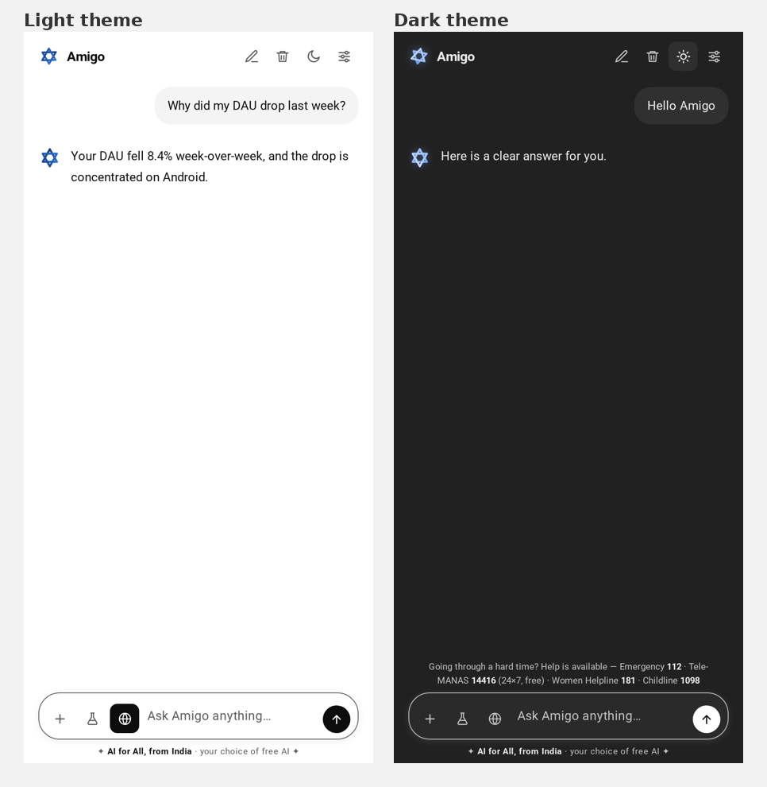

# Amigo — a single-file AI chat app

A complete, browser-based AI assistant in **one HTML file**. No build step, no server, no installation — open the file and start chatting.

Live demo (GitHub Pages): https://bholasee8816-art.github.io/amigo-ai-chat/



---

## Highlights

- **25 built-in skills** — product analytics, metric reasoning, A/B testing, time-series, deck building, design critique, UI critique, file triage, changelog reporting and more. Each one carries its own expert instructions.
- **Auto-routing** — on the first message, the app reads what you asked and picks the right skill by itself. You can also pin a skill from Settings.
- **Long, structured answers** — replies come back in the style of Google's AI Mode: a short highlighted summary, then numbered sections and bullet points with the key terms in bold. A **Stop** button lets you cut a long answer short.
- **Google Gemini first** — Gemini is the default provider, with free Puter as the automatic fallback, so the app always answers even before you add a key.
- **Deep Search** — switch it on and the app checks several big sites at once (Wikipedia, Wikidata, DuckDuckGo, Stack Overflow, Hacker News, GDELT news, Open Library, Crossref, OpenAlex, GitHub, Open-Meteo weather), then answers with clickable source links.
- **Live trends** — ask "what's trending?" and it reads what the world is looking at right now: Wikipedia's most-viewed pages, the Hacker News front page and world news.
- **Pasted links are read** — paste any URL and the app fetches that page and summarises it.
- **Image generation** — ask for a picture ("draw me…") and the app draws it right in the chat, with a download button. Free and keyless (uses Puter).
- **Copy any message** — a small Copy button sits under every message, yours and the AI's.
- **Browser-side data tools** — drop in a CSV for a data profile, or run a funnel analysis, trend chart, segmentation and an A/B test calculator right in the page.
- **A modern, minimal interface** — dark by default (light one tap away), a left sidebar with all your chats, a soft glow behind the greeting, and one pill composer where everything lives inside the **+** menu: upload a data file, the A/B calculator, image generation, live trends and deep search.
- **Private** — everything runs in your browser. Chats and settings live in your browser's `localStorage`.

## Run it

**Easiest:** download `index.html` and open it in any modern browser (double-click the file).

**As a website:** this repository is published with GitHub Pages, so you can use it directly at
https://bholasee8816-art.github.io/amigo-ai-chat/

**Locally with a server (optional):**

```bash
python3 -m http.server 8000
# then open http://localhost:8000/index.html
```

## Choosing an AI provider

Open **Settings** (in the sidebar, or the sliders icon top right):

| Provider | Key needed | Notes |
| --- | --- | --- |
| **Google Gemini** (default) | Yes | Free key at aistudio.google.com → "Create API key". |
| Puter | No | Free. A small sign-in popup may appear on first use. |
| Groq | Yes | Fast and free-tier friendly. |
| OpenRouter | Yes | One key, many models. |
| OpenAI-compatible | Yes | Any endpoint + model. |

If the selected provider has no key, or ever fails, the app automatically answers through free Puter — you never have to switch anything by hand.

> **Never commit API keys.** Keys are entered at runtime in Settings and are stored only in your own browser. This repository contains no keys.

## The + menu

Everything that used to sit in the bottom bar now lives inside the **+** button:

- Upload a data file (CSV)
- A/B test calculator
- Create images
- Live trends
- Deep search the web

A ✓ marks whichever modes are switched on.

## Safety

The app shows Indian helpline numbers for anyone in distress (Emergency 112, Tele-MANAS 14416, Women Helpline 181, Childline 1098) and is instructed to respond with care.

## Tech

Plain HTML, CSS and JavaScript in a single file. No frameworks, no bundler, no dependencies beyond the optional Puter script tag used for the free provider.

## License

MIT — use it, change it, share it.
